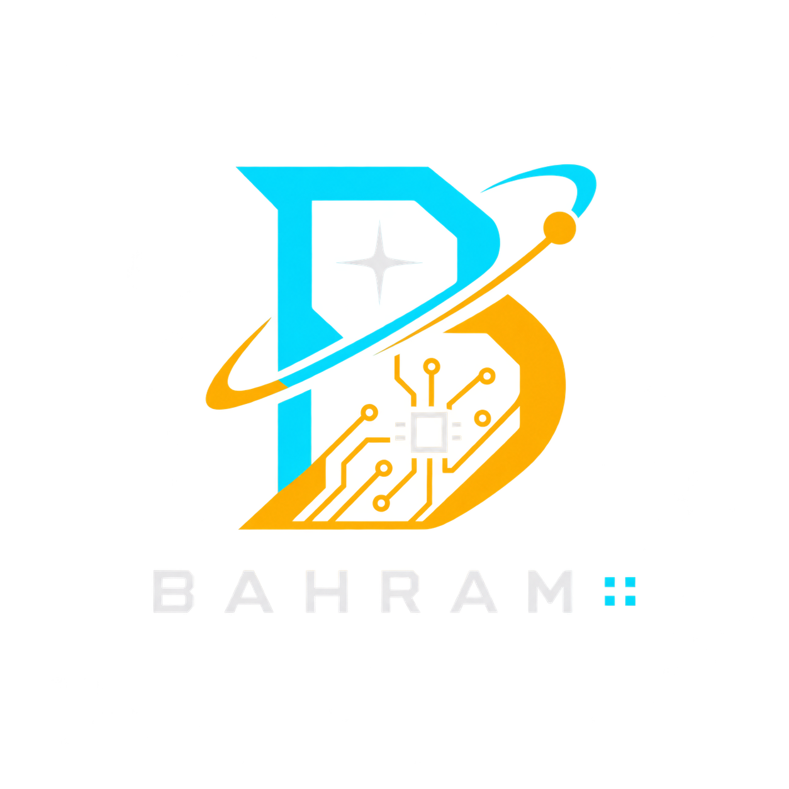

<p align="center">
  
</p>
<a href="en.md">English</a>
<p align="center">
  <b>Bahram (بهرام)</b><br/>
  زبان دامنهٔ هوافضا و سیستم‌های تعبیه‌شده — اجرای مستقیم + شبیه‌ساز + Ada/SPARK
</p>

<p align="center">
  <code>Bahram hello.bz run</code>
  &nbsp;·&nbsp;
  <code>bahramsim run adcs.bz</code>
</p>

---

# بهرام (Bahram)

**Bahram** یک زبان برنامه‌نویسی دامنه‌محور (DSL) برای نرم‌افزارهای **حیاتی هوافضا و تعبیه‌شده** است: کنترل پرواز، ADCS ماهواره، FADEC، سنسور و تسک بلادرنگ.

| قابلیت | توضیح |
|--------|--------|
| سینتکس نمادگرا | `@ # ? ~ ! ^ $ > < ..` |
| اجرا بدون GNAT | مفسر داخلی برای فایل `.bz` |
| شبیه‌ساز کنسولی | سخت‌افزار مجازی + سنسور + فیزیک **RK4** |
| خروجی Ada/SPARK | قرارداد `pre`/`post`، مسیر نزدیک به DO-178C |
| واحد فیزیکی | مانند `Angle<rad>`، `Torque<N_m>` |
| مدل خطا | `Result` — بدون Exception |

---

## ۱. دربارهٔ پروژه

### هدف

نوشتن منطق کنترل و اویونیک با زبانی **ساده و قابل اثبات**، سپس:

1. **اجرای فوری** روی سیستم خودتان (ویندوز/لینوکس) بدون نصب Ada  
2. **شبیه‌سازی** سنسور و دینامیک در ترمینال  
3. در صورت نیاز **تولید Ada/SPARK** برای ابزارهای رسمی (GNAT / GNATprove)

### ساختار پوشه

```text
bahram/
├── Bahram.py / Bahram.cmd      # اجرای برنامه
├── bahram_sim.py / bahramsim   # شبیه‌ساز
├── compiler/                   # پارسر، نوع، تولید Ada
├── interpreter/                # مفسر
├── simulator/                  # HW، سنسور، RK4
├── examples/                   # نمونه‌های .bz
├── stdlib/std/                 # کتابخانه استاندارد
├── grammar/Bahram.g4
├── docs/                       # مشخصات و آموزش
├── playground/                 # ویرایشگر وب
├── vscode-bahram/              # افزونه VS Code
├── assets/bahram-logo.png
└── dist/                       # باینری آماده (در صورت build)
```

### نمونه کد

```bahram
@spark_level(Gold)

# factorial(n :: Int) -> Int
pre: n >= 0
post: result >= 1
? n <= 1
! 1;
..
! n * $factorial(n - 1);
..

# main() -> Int
@ r :: Int := $factorial(6);
$print(r);
! r;
..
```

---

## ۲. از گیت‌هاب تا ویندوز

### پیش‌نیاز

- ویندوز ۱۰ یا ۱۱  
- **حالت A (توسعه‌دهنده):** Python 3.11+ از [python.org](https://www.python.org/downloads/) با تیک **Add to PATH**  
- **حالت B (کاربر نهایی):** فقط `Bahram.exe` و/یا `bahramsim.exe` — **بدون پایتون**

### گام ۱ — دریافت کد

```bat
git clone https://github.com/USER/bahram.git
cd bahram
```

یا `Full-Bz.zip` را از Releases دانلود و Extract کنید، سپس:

```bat
cd bahram
```

### گام ۲ — نصب پکیج‌ها (فقط حالت سورس)

```bat
python -m pip install -r requirements.txt
```

اگر فقط exe دارید، این مرحله لازم نیست.

### گام ۳ — اولین اجرا

**با سورس:**

```bat
python Bahram.py examples\hello.bz
python Bahram.py examples\hello.bz run
python Bahram.py run examples\factorial.bz
```

**بدون پایتون (بعد از داشتن exe):**

```bat
Bahram.exe hello.bz
Bahram.exe hello.bz run
Bahram.exe run factorial.bz
```

خروجی factorial باید `720` باشد.

### گام ۴ — ساخت exe روی ویندوز (یک‌بار برای پخش)

```bat
build_windows.bat
```

→ `dist\Bahram.exe`

```bat
build_bahramsim.bat
```

→ `dist\bahramsim.exe`

از این به بعد کاربر فقط:

```bat
Bahram.exe myprog.bz run
bahramsim.exe run examples\adcs_3axis.bz
```

---

## ۳. کامپایلر و کدنویسی

### دستورهای روزمره

| دستور | کار |
|--------|-----|
| `Bahram file.bz` | اجرا |
| `Bahram file.bz run` | اجرا |
| `Bahram run file.bz` | اجرا |
| `Bahram check file.bz` | تحلیل ایستا |
| `Bahram help` | راهنما |

با سورس معادل همان با `python Bahram.py ...` است.

### تولید Ada

```bat
python bahramc.py examples\fadec.bz -c -o fadec.adb
```

کد شامل `SPARK_Mode` و قراردادهاست. برای اثبات رسمی به GNAT/GNATprove جداگانه نیاز است.

### مثال‌ها

| فایل | موضوع |
|------|--------|
| `examples\hello.bz` | شروع |
| `examples\factorial.bz` | قرارداد + بازگشتی |
| `examples\flybywire.bz` | کنترل پرواز |
| `examples\fadec.bz` | FADEC |
| `examples\sensor_reader.bz` | سنسور + تسک |
| `examples\adcs_3axis.bz` | ADCS |
| `examples\control_flow.bz` | else / for / enum / match |

### VS Code

پوشه `vscode-bahram` را کپی کنید به:

```text
%USERPROFILE%\.vscode\extensions\bahram-2.0.0
```

VS Code را یک‌بار ببندید و باز کنید. فایل `.bz` هایلایت می‌شود.

### Playground وب (اختیاری)

```bat
python -m pip install fastapi uvicorn
python -m uvicorn api.main:app --host 127.0.0.1 --port 8000
```

سپس `playground\index.html` را باز کنید.

---

## ۴. شبیه‌ساز (`bahramsim`)

کد را تفسیر می‌کند، سنسور و محرک مجازی می‌سازد، زمان را با **RK4** جلو می‌برد و نتیجه را در ترمینال نشان می‌دهد.

### ویندوز

```bat
python bahram_sim.py run examples\adcs_3axis.bz --duration 2 --step 0.05 --plot torque
```

یا:

```bat
bahramsim.exe run examples\adcs_3axis.bz --duration 2 --step 0.05 --plot torque
```

### لینوکس

```bash
./bahramsim run examples/adcs_3axis.bz --duration 2 --step 0.05 --plot torque
```

### گزینه‌ها

| گزینه | معنی |
|--------|------|
| `--duration 5` | مدت شبیه‌سازی (ثانیه) |
| `--step 0.01` | گام زمانی |
| `--real-time` | همگام با ساعت واقعی |
| `--log out.csv` | لاگ فایل |
| `--plot torque` | نمودار ASCII |
| `--target "STM32F4"` | برچسب در بنر |

### دیباگ

```bat
python bahram_sim.py debug examples\hello.bz
```

دستورات: `break` · `print` · `watch` · `run` · `stack` · `quit`

### اجزای شبیه‌ساز

- سخت‌افزار: GPIO، ADC، UART، Timer، Watchdog  
- سنسور: Gyro، Accel، Mag، Baro، Temp، GPS  
- فیزیک: جسم صلب + **RK4** + مدار LEO تقریبی  

---

## ۵. مسیر پیشنهادی روی ویندوز

1. `Bahram.exe run examples\hello.bz`  
2. ویرایش `examples\factorial.bz` و اجرای دوباره  
3. `Bahram check examples\fadec.bz`  
4. `bahramsim run examples\adcs_3axis.bz --duration 1 --plot torque`  
5. فایل خودتان: `myctrl.bz` → `Bahram myctrl.bz run`  

---

## ۶. نمادهای زبان (خلاصه)

| نماد | نقش |
|------|------|
| `@` `@!` | متغیر / ثابت |
| `#` | تابع |
| `?` `: else` | شرط / else |
| `~` | حلقه / for |
| `!` | return |
| `^` | تسک |
| `$` | فراخوانی |
| `>` `<` | پیام بین تسک‌ها |
| `..` | پایان بلوک |
| `pre:` `post:` | قرارداد SPARK |

مستندات بیشتر: `docs\LANGUAGE_SPEC.md` · `docs\TUTORIAL.md` · `docs\WINDOWS.md` · `docs\END_USER.md`

---

## ۷. عیب‌یابی ویندوز

| مشکل | کار پیشنهادی |
|------|----------------|
| `python` شناخته نمی‌شود | نصب با PATH، یا فقط استفاده از exe |
| فایل پیدا نمی‌شود | از داخل پوشه `bahram` اجرا کنید |
| متن فارسی ناخوانا | در CMD: `chcp 65001` |
| نمی‌خواهید پایتون دیده شود | build بگیرید و فقط `dist\*.exe` را پخش کنید |

---

## ۸. مجوز

استفاده آموزشی و تحقیقاتی با ذکر منبع آزاد است.

---

<p align="center"><b>Bahram</b> — از کلون گیت‌هاب تا اجرا و شبیه‌سازی روی ویندوز</p>
